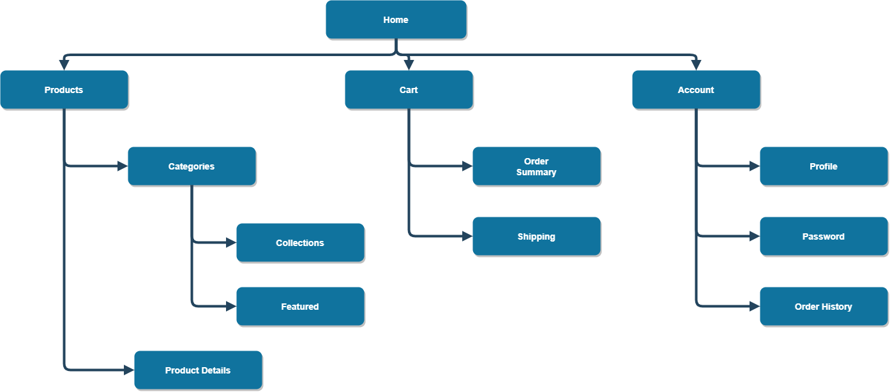
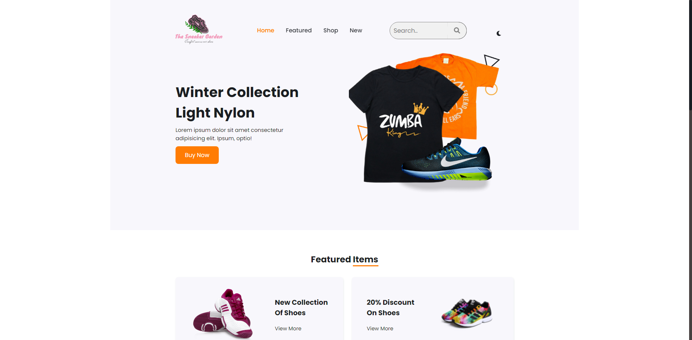
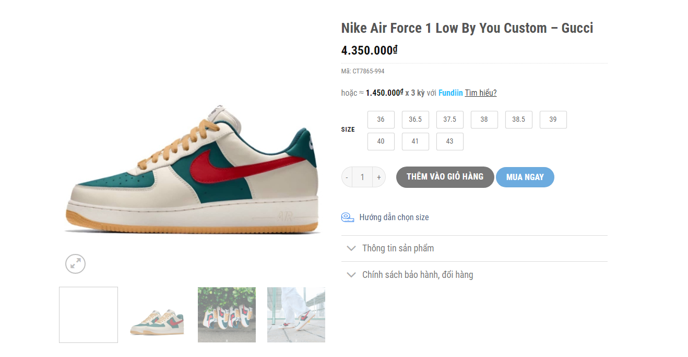
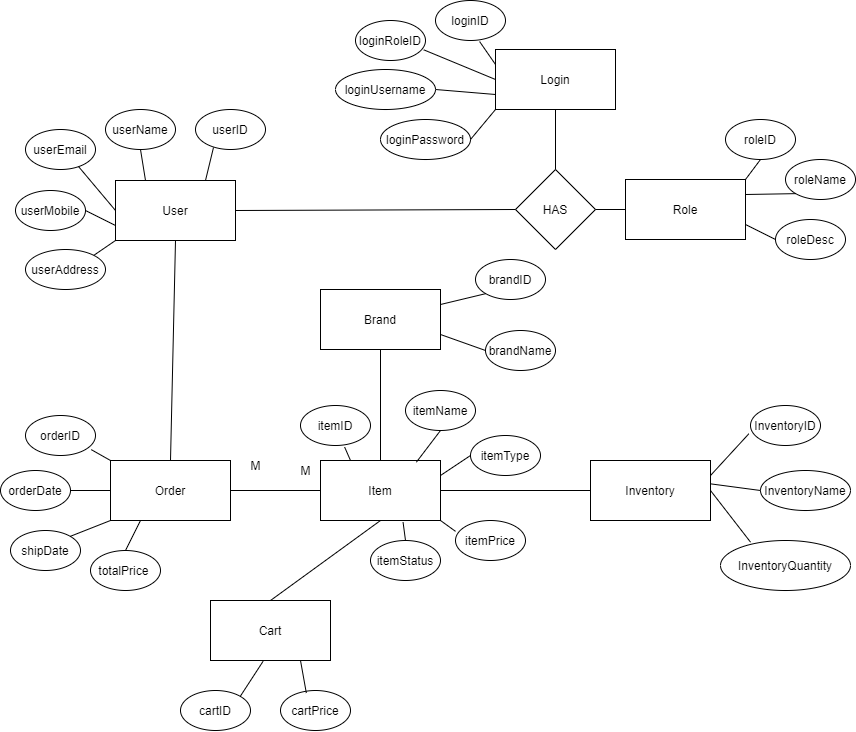

# The Sneaker Garden
  The Sneaker Garden is the place for those of you who have an intense love and vitality for sneakers. The Sneaker Garden places a lot of emphasis on customer service and ease of shopping experience.
  
  Here we:
- Receiving orders, selling available all lines of shoes, sandals, shoe accessories from Nike, Adidas, Jordan...
- Commitment to only sell genuine products, say no to fake.
- Goods are shipped directly from foreign stores with full invoices and documents.
- Offers free shipping, free exchanges, and free returns within 3 days of shoe purchase.

# 1. Case Study
## Purpose
Is a system that helps customers easily find out necessary information about the product. Help customers have a detailed view of the product as well as evaluate the product in the most honest way. Besides, due to the functionality of the website, the seller can easily structure and systematize all the data, making working with it as efficient and convenient as possible.
## Object
For those who are customers who have shopping needs about shoes in general and sneakers in particular.
## Features
Decentralization system (manager and customer).

**Customer**
- Provide detailed information with visual product images
- Filter search function
- Register an account
- Purchase
- Cart feature

**Manager**
- Product management (Add, Update, Delete, the number of products)
- Function to Manage customer information
- Order management
- Function to report revenue, number of buyers, best-selling products to evaluate business performance

## Tools
HTML, CSS, Javascripts, Servlet

## Contributors
- Nguyễn Quốc Công
- Lê Trần Quang Linh
- Nguyễn Hoàng Phi Long
- Nguyễn Đình Bảo Khánh
# 2. Wireframe

## Database
- ER model

- Diagram 
# 3. Conclusion
- Learn how to use github
- Learn how to run and manage a website 
- Learn more about SQL,Servlet,Session,after doing this mini project  we also improved our coding skills 
- Receive the teacher's instructions to improve our website

